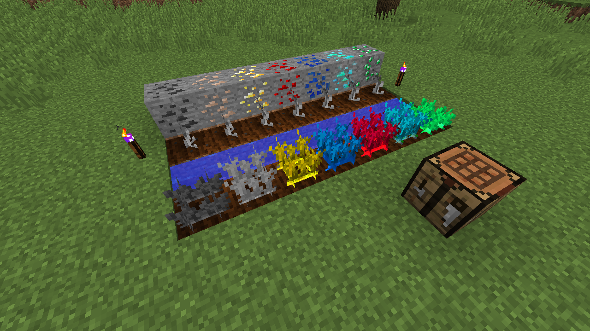

# 矿物农场模组

一个为Minecraft 1.12.2设计的模组，为游戏添加了矿物 farming 的功能。

## 概述

矿物农场是一个允许玩家像种植庄稼一样种植矿物的模组。玩家不再需要传统的挖矿方式，而是可以通过种植特殊的种子来获得各种矿物资源。这为Minecraft增加了全新的游戏维度，将农业与资源收集结合起来。

## 特性

### 新物品
- 贫瘠钻石 - 一种低等级的钻石，可以合成普通钻石
- 钻石碎片 - 用于合成贫瘠钻石
- 绿宝石碎片 - 用于合成绿宝石
- 各种植物种子：
  - 钻石碎片植物种子
  - 绿宝石碎片植物种子
  - 煤炭碎片植物种子
  - 铁碎片植物种子
  - 金碎片植物种子
  - 红石碎片植物种子
  - 青金石碎片植物种子
  - 钻石矿石种子
  - 绿宝石矿石种子
  - 煤炭矿石种子
  - 铁矿石种子
  - 金矿石种子
  - 红石矿石种子
  - 青金石矿石种子

### 新方块
- 贫瘠钻石矿石 - 可开采的方块，掉落贫瘠钻石
- 各种作物方块用于种植矿物相关物品：
  - 钻石作物
  - 绿宝石作物
  - 煤炭作物
  - 铁作物
  - 金作物
  - 红石作物
  - 青金石作物
  - 钻石植物
  - 绿宝石植物
  - 煤炭植物
  - 铁植物
  - 金植物
  - 红石植物
  - 青金石植物

## 合成配方

### 基础合成
- 9个钻石碎片 = 1个贫瘠钻石
- 9个绿宝石碎片 = 1个绿宝石

### 种子制作
每种种子都可以使用特定的模式，通过小麦种子和相应的矿物/锭/粒来合成。

### 熔炼
- 贫瘠钻石 = 1个钻石（在熔炉中）

## 种植过程

1. 制作你想要种植的种子
2. 像普通作物一样将种子种在农地上
3. 等待它们经历8个生长阶段（0-7）
4. 收获完全成熟的作物以获得相应的物品
5. 使用收获的物品进行合成或熔炼

## 安装方法

1. 下载并安装Minecraft 1.12.2
2. 下载并安装Minecraft Forge 1.12.2
3. 下载矿物农场模组的.jar文件
4. 将.jar文件放入你的Minecraft mods文件夹中
5. 使用Forge配置启动Minecraft

## 兼容性

此模组兼容：
- Minecraft 1.12.2
- Forge 14.23.5.2860
- JEI (Just Enough Items) - 用于查看配方

## 已知问题

- 如果存在模组冲突，某些配方可能在JEI中不可见
- 如果纹理文件缺失，模型可能无法正确加载

## 从源代码构建

要从源代码构建此模组：
1. 克隆代码仓库
2. 在项目目录中运行 `./gradlew build`
3. 构建的.jar文件将位于 `build/libs` 文件夹中

## 许可证

此模组基于MIT许可证发布。有关详细信息，请参阅LICENSE文件。

## 鸣谢

- 作者：MCOCET
- 以及原mod的作者：TheCCB, TheHacker000
- 使用Minecraft Forge 1.12.2
- 